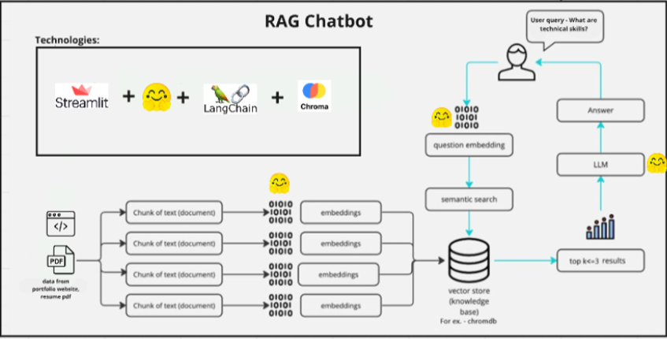

# KBot - Kaushikee's Virtual Assitant [RAG Chatbot] 

### Walkthrough video - https://youtu.be/giBb05bV0XY 
------------------------
## Project Overview
 AI-powered chatbot using Retrieval-Augmented Generation (RAG) that showcases personal skills, projects, and achievements. The chatbot allows users to submit natural language queries about the portfolio owner's profile, providing an interactive and engaging experience.

## Features
- AI-powered RAG chatbot integrated using Streamlit, Hugging Face transformers, and Pinecone/Chroma for vector storage
- Easy-to-follow setup instructions for cloning and running the project locally
  
## Project Architecture

## Prerequisites
Before you begin, ensure you have the following installed on your system:
- Python (v3.7 or later)
- pip (Python package installer)

## Setup Instructions
1. Clone the Repository
2. Setup and Run the Chatbot
- Install Python Dependencies: Navigate to the chatbot directory and install the required Python packages:

```bash
cd ../portfolio_kbot
pip install -r requirements.txt
```
- Create Vector embeddings: Once the dependencies are installed, generate vector embeddings by running the following command:
```bash
python vector_embeddings.py
```
- Now run the Chatbot app: Once the embeddings are generated and stored in the `data` directory, run the following command
```bash
streamlit run ResumeBot.py
```
The chatbot will be accessible at http://localhost:8501. You can interact with it by submitting natural language queries.


## License
This project is licensed under the MIT License. See the LICENSE file for more details.
